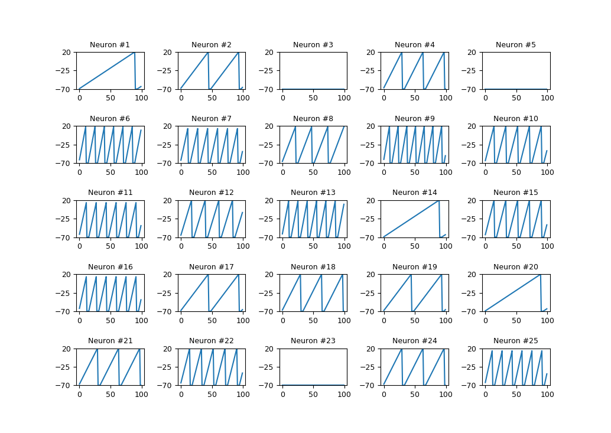

## Spyky

Spyky is a light-weight Machine Learning Framework for Spiking Neural Nets (SNN).

### Spiking Neural Nets (SNN)

A Spiking Neural Network (SNN) is a third generation artificial neural network that integrates time into the operating model. Neurons apart of the SNN represent many different types of neurons found in the brain. The difference between a SNN and a standard perceptron network, is that a Neuron in a SNN is only fired when a membrane potential reaches a specific value, called the activation potential. When a membrane potential is reached a "spike" is generated to downstream neurons. These spikes are called spike trains.

### To Do:

- [ ] GPU Support
- [ ] Examples

### To Run:
```
./data.sh
python3 -m virtualenv env
source env/bin/activate
pip install -r requirements.txt
```

### 25 Integrate-and-Fire Neurons with Voltage and Spike Trains



